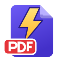
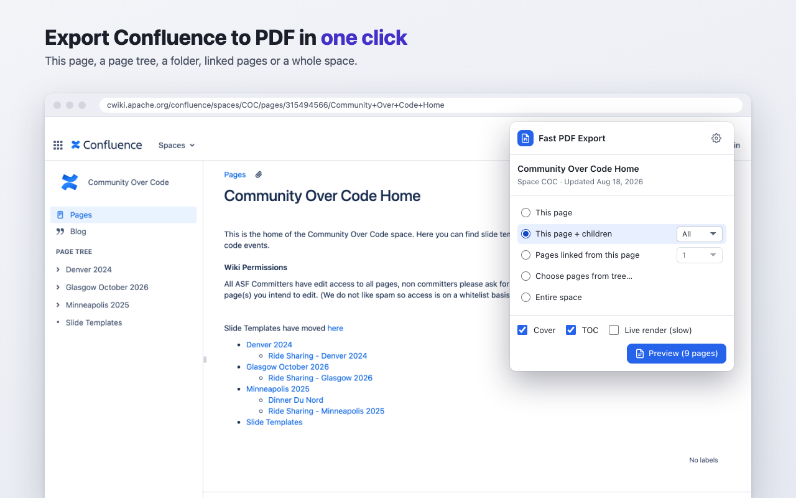
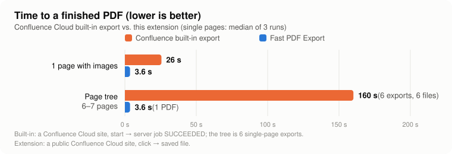
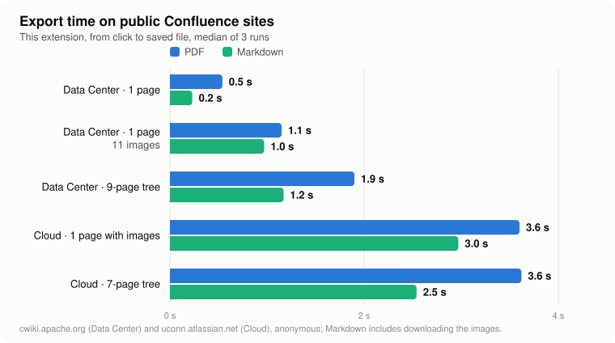
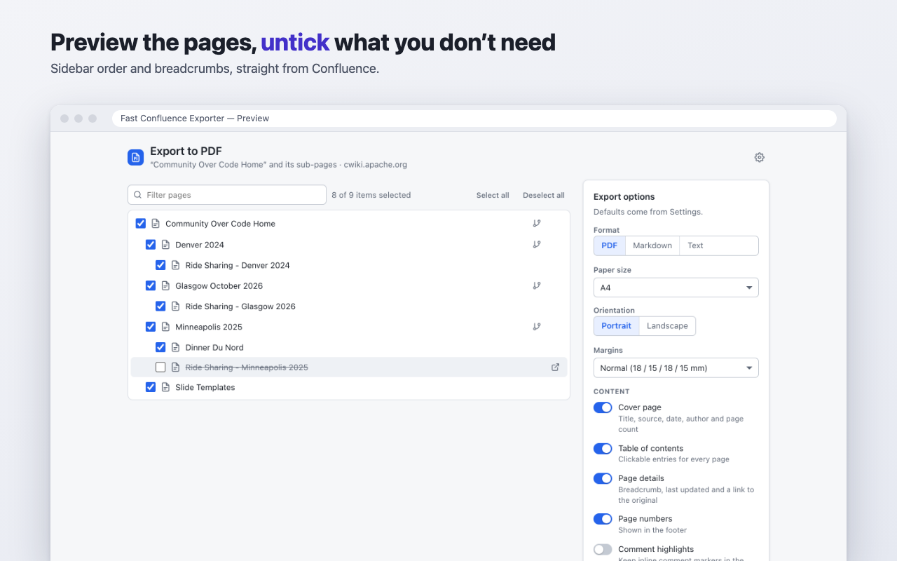
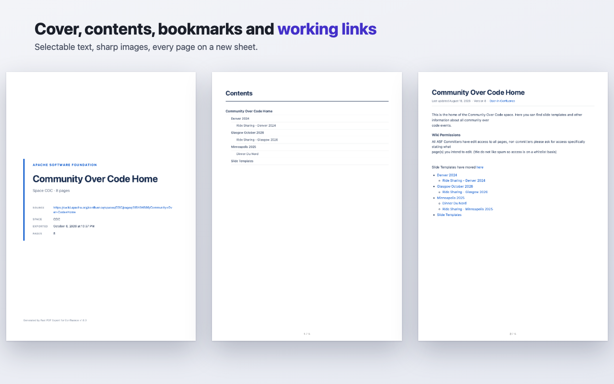
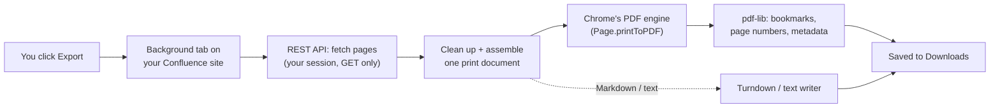

<p align="center">
  
</p>

<h1 align="center">Fast PDF Export for Confluence</h1>

<p align="center">
  <strong>Export Confluence pages, page trees and whole spaces into one clean PDF, Markdown or text file, in seconds, right in your browser.</strong>
</p>

<p align="center">
  <a href="LICENSE"></a>
  
  
  
</p>

<p align="center">
  
</p>

## Why

Confluence's built-in PDF export runs as a queued job on the server: **about 25 seconds for a single
page** in our measurements, and **one page at a time**. Exporting a 6-page section means six exports
and almost 3 minutes of waiting, ending with six separate files.

Fast PDF Export builds the document **in your browser**, from the pages you can already see:

- **Fast.** One page in a few seconds, a whole page tree in one go: **~7× faster** for a page and
  **~40× faster** for a 6-page section (measurements below).
- **Many pages, one document.** Page + children, a folder, pages linked from a page, a hand-picked
  selection or an entire space. The PDF gets a cover, a clickable table of contents, nested
  bookmarks, page numbers, and links between pages that jump inside the PDF.
- **PDF, Markdown or plain text.** Markdown (GitHub-flavoured) can include the page images in a
  ZIP, which is handy for Git repos, docs sites and LLM prompts.
- **Private and read-only.** No server, no account, no API token. Only `GET` requests to your own
  Confluence, using your existing session; nothing is sent anywhere else.
- **Any Confluence.** Cloud (including custom domains) and Data Center / Server.

## Speed

<p align="center">
  <picture>
    <source media="(prefers-color-scheme: dark)" srcset="docs/images/speed-vs-builtin-dark.svg">
    
  </picture>
</p>

<p align="center">
  <picture>
    <source media="(prefers-color-scheme: dark)" srcset="docs/images/speed-public-dark.svg">
    
  </picture>
</p>

<details>
<summary>How this was measured</summary>

Measured on 2026-10-07 in Chrome 154 on macOS. Raw numbers: [docs/benchmarks.json](docs/benchmarks.json);
charts: `node scripts/readme-charts.mjs`.

| | Confluence built-in | Fast PDF Export |
|---|---|---|
| 1 page with images | 25.6 s (24.5 / 25.6 / 26.0) | 3.6 s PDF · 3.0 s Markdown |
| 1 text page with a Jira table | 24.1 s (24.0 / 24.1 / 24.9) | n/a |
| Page tree | 160 s for 6 pages = 6 separate exports, 6 files | 3.6 s for 7 pages, 1 PDF |

- **Built-in export:** a logged-in user on a Confluence Cloud site, from starting the export until
  Confluence's export job reports `SUCCEEDED` (the download itself not included). Cloud has no
  built-in way to put a page tree into one PDF short of a space export, so the tree is six
  single-page exports in a row.
- **Fast PDF Export:** the opt-in live test harness (`npm run test:live`, Playwright's Chromium)
  against the public sites [cwiki.apache.org](https://cwiki.apache.org/confluence) (Data Center)
  and [uconn.atlassian.net](https://uconn.atlassian.net/wiki/spaces/AI/overview) (Cloud), as an
  anonymous visitor, from starting the export until the file is saved. Median of 3 runs.
- The two sides ran on different Cloud sites (the built-in export needs a login, which the public
  sites don't offer to us), so compare orders of magnitude rather than decimals. Your numbers will
  depend on page size, images and network.

</details>

## Screenshots

| Preview and prune the pages | The result |
|---|---|
|  |  |

## How it works



The extension opens a background tab on a lightweight JSON URL of the Confluence site you are on,
so every request is same-origin and uses your existing login (or none, on public sites). It
fetches the pages through the REST API, sanitizes them, rewrites links between exported pages, and
assembles one print-ready document. Chrome's own engine prints it to a real vector PDF
(selectable text, sharp images), and pdf-lib adds the bookmarks and metadata. Markdown and text
are converted in the same tab instead of printed.

Content that can't be printed from a static copy (embeds, live app macros) becomes a visible
placeholder with a link, never silently dropped. Diagrams drawn by apps such as draw.io can be
included with the optional **Live render** mode.

## Install

- **Chrome Web Store:** coming soon.
- **From source:**

  ```bash
  npm ci && npm run build
  ```

  Open `chrome://extensions` (or `edge://extensions`, `brave://extensions`), turn on
  **Developer mode**, click **Load unpacked** and pick `.output/chrome-mv3`.

Then open any Confluence page and click the toolbar icon (or press **Alt+Shift+P** to export the
current page). The first export from a site asks for access to **that site only**.

Full feature list, options, permissions and troubleshooting: **[User guide](docs/USER_GUIDE.md)**.

## Tech stack

| | |
|---|---|
| Extension | TypeScript, [WXT](https://wxt.dev) (Manifest V3), [Preact](https://preactjs.com) |
| PDF | Chrome DevTools Protocol `Page.printToPDF` via `chrome.debugger`, [pdf-lib](https://pdf-lib.js.org) |
| Content | [DOMPurify](https://github.com/cure53/DOMPurify), [Turndown](https://github.com/mixmark-io/turndown) + GFM plugin, [fflate](https://github.com/101arrowz/fflate) |
| Confluence | REST API v2 (Cloud) and v1 (Data Center / Server), no API tokens |
| Tests | Vitest + happy-dom, Playwright E2E against a mock Confluence, opt-in live tests on public Confluence sites |

## Development

```bash
npm ci               # install
npm run dev          # Chrome with the extension and hot reload
npm test             # unit tests
npm run test:e2e     # end-to-end tests against a local mock Confluence
npm run build        # production build → .output/chrome-mv3
```

Start with **[AGENTS.md](AGENTS.md)** (code map, conventions, how to test), then
[docs/ARCHITECTURE.md](docs/ARCHITECTURE.md) and [docs/TESTING.md](docs/TESTING.md).
Enterprise deployment and policies: [docs/ENTERPRISE.md](docs/ENTERPRISE.md). Changes:
[CHANGELOG.md](CHANGELOG.md). Privacy: [PRIVACY.md](PRIVACY.md).

## License

[MIT](LICENSE) © 2026 Michal Tajchert. Bundled third-party notices:
[THIRD_PARTY_LICENSES.txt](public/THIRD_PARTY_LICENSES.txt).

"Confluence" is a trademark of Atlassian. This extension is not affiliated with or endorsed by Atlassian.
